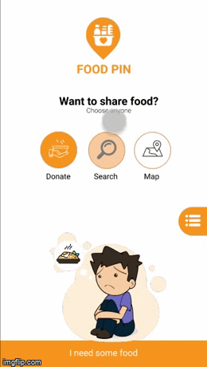
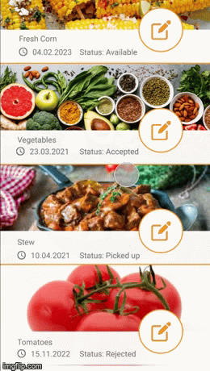
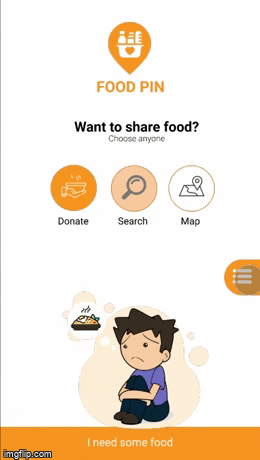
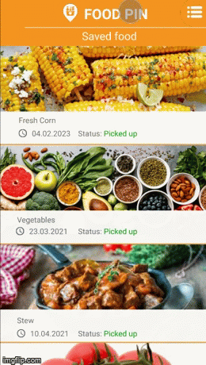
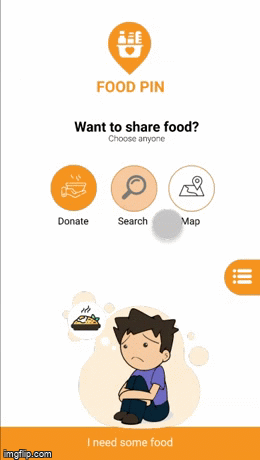

# FOODPIN

###The purpose of the app is to connect people which want to save food. One user announce that have spare food and he will give it to another user for free instead of throw it up and waste. The idea is to pin donations on a map a let user browse to find food in the neighbourhood which can be used by him. 

###Backend by [Robert Matląg](http://github.com/RobertMatlag)
**Technologies: Python, Django, Django Rest Framework, PostgreSQL**

### Frontend by [Marcin Chałuda](http://github.com/marcinchaluda)
**Technologies: Angular, Typescript, Sass**

###Project tools
**Technologies: Jira, Figma, Swagger**

##Prototypes
### Adding new donation
Logged-in user can add own donation, there is space to precise what is the product, what is an amount of products, 
address and time to pick up. User can describe an announcement and give more details.
There is also check box to confirm that food is of good quality and hygiene was maintained.

### Donation's edition
Logged-in user can edit his own donations in any purpose.

### Sign up, sign in, edition of personal data
A guest can sign up and login to app. After registration there is possibility to change personal data.

### Review of user's donation and accepted offers, food evaluation
Logged-in user can check list of his donations and list of donations which he accepted in the past.
During the delivery of food, the receiving user may accept the donation or reject it if the food is spoiled.

### Review of available donations from user and accept one
Logged-in users and guests can browse list of donations. A logged-in user can accept a donation.

### Map management (there will pins with donations)
There is possibility browse map and check what food can be received in a neighbourhood.

### App stats and about page
The app has a page with a statistic for example how many trades between users has made or how much food was saved.

